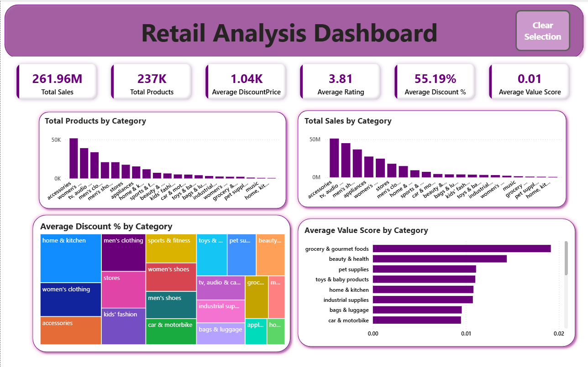
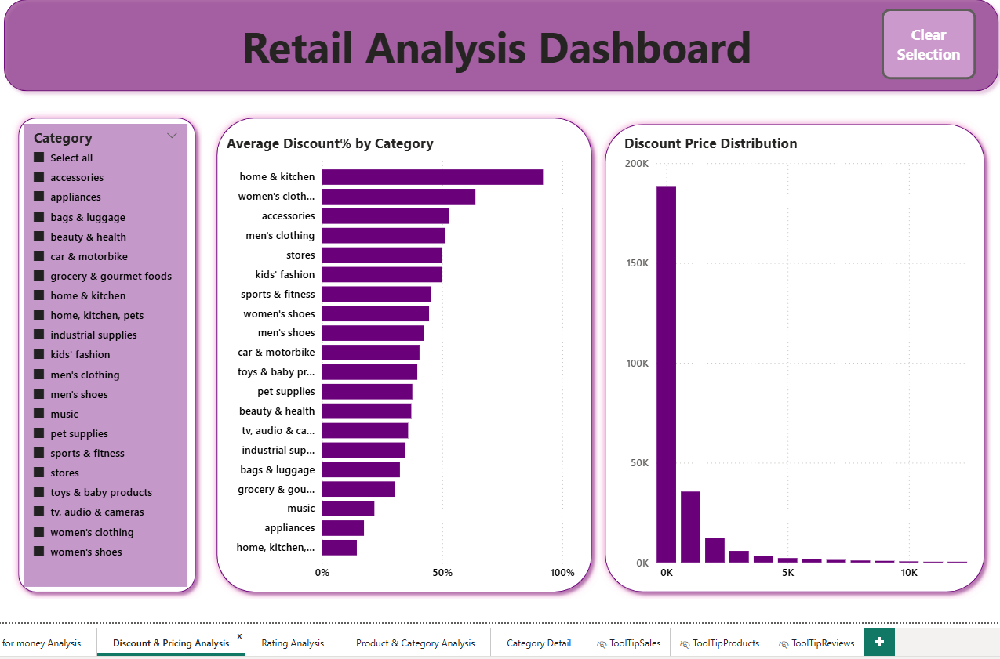
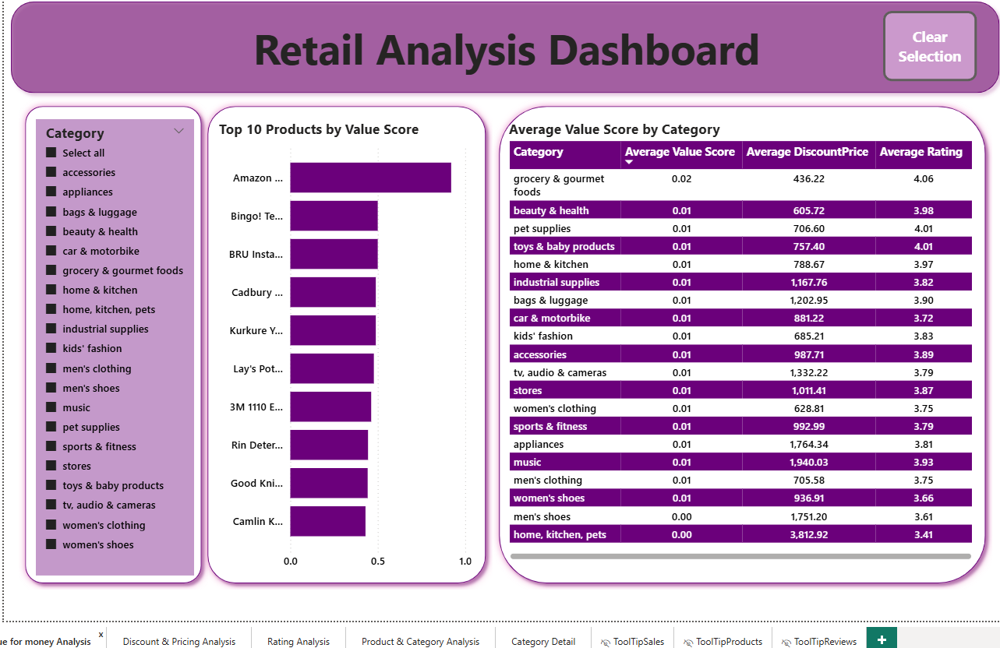
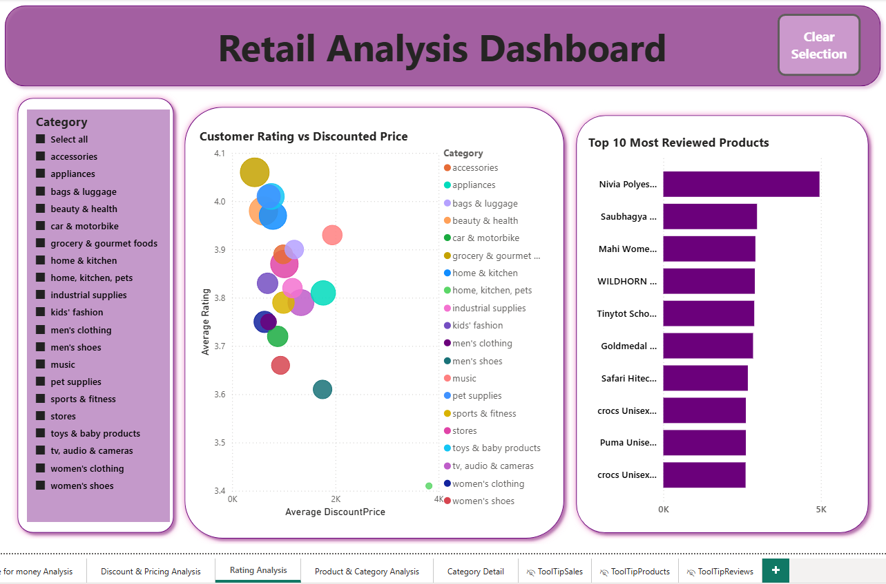

# Retail Business Performance Analysis

## Project Overview
This project analyzes retail product data to understand sales performance, pricing strategies, and customer value perception across product categories.

The analysis focuses on identifying which categories and products drive the most revenue, how discounts influence pricing strategies, and how customer ratings relate to product pricing. Insights are presented through an interactive Power BI dashboard supported by Python data preparation and SQL validation.

## Business Problem

Retail businesses manage large product catalogs and complex pricing strategies. However, identifying which products truly drive revenue and customer value can be challenging.

High discounts do not always lead to higher customer satisfaction or profitability. Some categories contain many products but generate relatively low sales, while others generate strong revenue with fewer items.

Without clear insights, pricing strategies and product promotions may not effectively support business growth. This project analyzes pricing, discounts, ratings, and value metrics to support data-driven retail decision-making.

## Project Objectives

- Analyze product distribution and sales performance across categories
- Evaluate discount strategies and pricing effectiveness
- Identify high-performing and high-value products
- Compare product ratings with pricing levels
- Validate business metrics using SQL

## End-to-End Data Pipeline

Raw Files → Python → SQL → Power BI

Python was used for data cleaning and preparation.
SQL was used for validating business logic and metrics.
Power BI was used for interactive data visualization and dashboard creation. 

## Dashboard Preview

### Sales Overview

### Category Performance Analysis

### Discount Strategy Analysis

### Value Score Analysis

### Rating Analysis

## Tools Used
- Python (Pandas, NumPy) – Data cleaning and preparation
- SQL – Data validation and business metric verification
- Power BI – Data visualization and dashboard development
